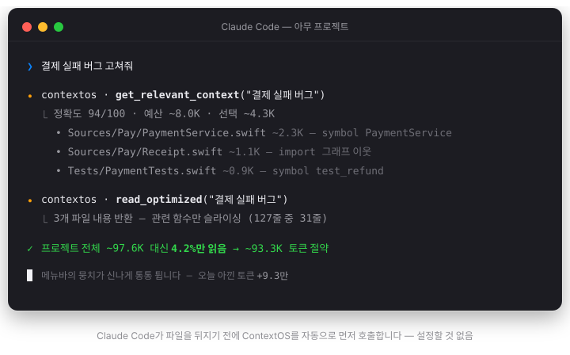
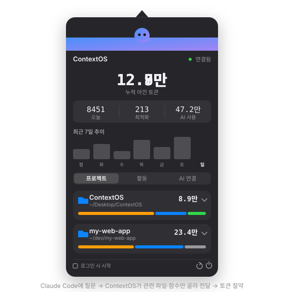

<p align="center">
  
</p>

<h1 align="center">ContextOS</h1>

<p align="center">AI 코딩 에이전트를 위한 로컬 컨텍스트 최적화 도구 · AI 없이 전부 내 컴퓨터에서</p>
<p align="center">Claude Code · Codex · Gemini CLI · Cursor · Windsurf</p>

<!--
  아래 두 데모는 실제 UI/동작을 그대로 재현한 애니메이션(SVG)입니다.
  실제 화면 녹화로 바꾸려면: 녹화본을 assets/ 에 gif로 저장한 뒤 src만 바꾸면 됩니다.
-->
<p align="center">
  
</p>
<p align="center">
  
</p>

---

**AI 코딩 에이전트를 위한 로컬 컨텍스트 최적화 도구.** AI를 쓰지 않고, 전부 내 컴퓨터에서만 동작합니다.

ContextOS는 AI 에이전트가 코드베이스 전체를 뒤지는 대신 **작업에 관련된 파일·함수만** 읽도록 도와줍니다. 그 결과 **더 적은 토큰으로 더 정확하게** 작업하게 됩니다. `contextos connect` 한 번이면 **Claude Code · Codex · Gemini CLI · Cursor · Windsurf** 중 설치된 모든 도구에 자동 연결됩니다.

> OpenAI / Claude / Gemini API 없음. LLM 호출 없음. 외부 서버 없음.
> AST·Tree-sitter 스타일 정적 분석·Git·파일시스템·규칙 기반 엔진만 사용합니다.

---

## 어떻게 동작하나요

1. `contextos connect` 를 한 번 실행하면, 설치된 각 AI 에이전트에 **"파일을 직접 탐색하기 전에 ContextOS부터 써라"** 는 지침이 심어지고 MCP 서버가 등록됩니다.
2. 이후 아무 프로젝트에서 에이전트로 작업하면, 에이전트가 **자동으로** ContextOS를 호출해 관련 파일만 받아 읽습니다.
3. 메뉴바 앱은 **얼마나 아꼈는지**를 실시간으로 보여줍니다.

당신은 아무것도 안 해도 됩니다. 최적화는 눈에 안 보이게 돌아갑니다.

```
평소처럼 AI 에이전트에 질문
   → ContextOS가 관련 파일·함수만 골라서 전달
   → 토큰 절약, 응답 품질 향상
```

---

## 주요 기능

- **프로젝트 인덱서** — 파일·심볼·import 관계를 한 번 분석해 로컬 SQLite에 저장. 이후엔 전체를 다시 읽지 않습니다.
- **스마트 파일 필터** — `node_modules`·`.git`·`build`·바이너리 등 노이즈 자동 제외. 프로젝트 루트의 `.gitignore` 패턴도 존중합니다.
- **자동 주입 훅** — Claude Code의 `UserPromptSubmit` 훅으로, **에이전트가 도구를 부르든 말든 매 프롬프트마다** 관련 파일·핵심 심볼을 자동 주입합니다. "먼저 ContextOS를 쓰라"는 지침에만 의존하지 않으니, 실제 절약이 매 턴 일관되게 발생합니다. (사소한 프롬프트는 건너뛰고, 실패해도 프롬프트를 막지 않음)
- **컨텍스트 옵티마이저** — 어휘 매칭 + **IDF 가중치**(희귀 심볼 우대) + import 그래프 확장으로 관련 파일을 랭킹하고, 토큰 예산 안에서 선택.
- **심볼 단위 슬라이싱** — 파일 전체 대신 **관련 함수 본문 + 나머지는 시그니처(목차)만** 전달. 큰 파일에서 토큰을 크게 절감.
- **세션 중복 제거** — 같은 세션에서 **이미 전달한 파일은 다시 보내지 않습니다** (내용이 바뀌었을 때만 재전송). 반복 질문 시 응답 크기가 ~90% 줄어듭니다.
- **예산 초과 파일 시그니처 목차** — 예산에 못 들어간 관련 파일도 이름만 버리지 않고 **심볼 목차(파일·라인·시그니처)** 로 압축해 함께 전달. 몇 토큰으로 주변 구조까지 파악.
- **능동적 쿼리 보정** — 110+ 항목 한↔영 개발용어 사전(조사 자동 제거: "삭제가"→`delete`), 오타 교정(프로젝트 실제 심볼과 대조), 인덱스 기반 확장. "장바구니 버그 고쳐줘" → `cart, bug, fix` 로 알아서 이해.
- **Git 신호** — 지금 편집 중인(커밋 안 된) 파일을 감지해 관련 컨텍스트를 미리 준비.
- **파일 감시** — 파일이 바뀌면 인덱스를 자동 갱신.
- **로컬 토큰 추정** — 외부 API 없이 토큰 수를 근사.
- **메뉴바 모니터** — 아낀 토큰(오늘/누적), AI 토큰 사용량, 연결된 AI 도구, 프로젝트별 사용량을 표시. "로그인 시 시작" 토글 지원.
- **살아있는 마스코트(뭉치)** — AI에게 **명령을 보낸 순간부터 응답이 끝날 때까지** 잔잔히 움직입니다. 세션 로그·MCP 하트비트로 실시간 감지하고, 로그가 조용해도 **마지막 이벤트가 미완료 툴 호출이면**(긴 빌드·테스트 실행 중) 계속 활동 상태를 유지합니다. ContextOS가 실제로 최적화하는 순간엔 **파일을 꿀꺽꿀꺽 삼키며**(관련 파일·함수만 골라 먹는 모습) 오물거리고, 아무 일도 없으면 조용히 숨만 쉬어요.
- **12개 언어 심볼 인덱싱** — Swift · Python · JS/TS · Go · Rust · Java · Kotlin · C · C++ · Ruby · Objective-C.

---

## 설치 & 사용

### 1. 빌드

```sh
swift build -c release          # CLI / MCP / 앱 빌드
swift test                      # 테스트
```

### 2. AI 에이전트에 연결 (핵심)

```sh
.build/release/contextos connect
```

이 한 줄이 **설치된 모든 AI 에이전트**를 자동으로 찾아 연결합니다:

| 에이전트 | MCP 등록 | 자동 사용 지침 |
|---|---|---|
| Claude Code | `claude mcp add` (전역) + 자동 주입 훅 | `~/.claude/CLAUDE.md` |
| Codex CLI | `~/.codex/config.toml` | `~/.codex/AGENTS.md` |
| Gemini CLI | `~/.gemini/settings.json` | `~/.gemini/GEMINI.md` |
| Cursor | `~/.cursor/mcp.json` | (Cursor 설정에서 규칙 추가) |
| Windsurf | `~/.codeium/windsurf/mcp_config.json` | — |

설치 안 된 도구는 건드리지 않고, 다시 실행해도 중복 없이 갱신만 됩니다. **도구를 재시작**하면 이후 모든 프로젝트에서 자동 적용됩니다.

### 3. 메뉴바 앱 (선택)

```sh
./scripts/build_app.sh          # → dist/ContextOS.app
open dist/ContextOS.app
```

더블클릭으로 실행되는 메뉴바 앱입니다. 아이콘을 클릭하면 절약량·AI 사용량·연결된 도구를 볼 수 있습니다.

---

## 구성

모든 로직은 `ContextOSCore` 에 있고, 나머지는 얇은 어댑터입니다.

```
Claude Code · Codex · Gemini
Cursor · Windsurf ──MCP(stdio)──▶ contextos-mcp ──▶ ContextOSCore ──▶ SQLite 인덱스
메뉴바 앱   ──────────────────────────────────────────┘
CLI (개발용) ─────────────────────────────────────────┘
```

| 타깃 | 역할 |
|---|---|
| `ContextOSCore` | 인덱싱·최적화·슬라이싱·보정 등 순수 로직 |
| `contextos` | CLI (`connect` · `context` · `watch`) |
| `contextos-mcp` | AI 에이전트용 MCP 서버 (stdio JSON-RPC) |
| `ContextOSApp` | SwiftUI 메뉴바 모니터 |

### CLI 명령

| 명령 | 설명 |
|---|---|
| `contextos connect` | 설치된 모든 AI 에이전트 자동 연동 (지침 설치 + MCP 등록) |
| `contextos context "<작업>"` | 관련 파일을 직접 찾기 (붙여넣기용) |
| `contextos watch [경로]` | 파일 변경 시 자동 재인덱싱 |

### MCP 도구 (AI 에이전트가 자동 호출)

| 도구 | 설명 |
|---|---|
| `get_relevant_context` | 작업에 관련된 최소 파일 목록 반환 |
| `read_optimized` | 관련 파일 내용을 (슬라이싱·세션 중복 제거해) 반환. `fresh=true`로 전체 재전송 |
| `index_project` | 프로젝트 강제 재인덱싱 |
| `project_stats` | 인덱스 통계 |
| `get_project_rules` | 프로젝트 규칙 파일(`.contextos/rules.md`·`CLAUDE.md`·`AGENTS.md`·`.cursorrules`) 읽기 |
| `restore_session` | 세션 시작용 프로젝트 상태 요약 (브랜치·미커밋 변경·최근 커밋·최근 활동) |

---

## 개발 환경

- macOS 14+ / Swift 6
- 의존성: `swift-argument-parser` (그 외 외부 의존성 없음, SQLite는 시스템 제공)

```sh
swift build        # 디버그 빌드
swift test         # 테스트
swift run contextos context "로그인 수정"   # CLI 실행
```

---

## 설계 철학

- 최대한 적은 컨텍스트로 최대한 높은 정확도.
- 프로젝트 전체를 반복해서 읽지 않는다.
- 모든 처리는 로컬에서. 개인정보는 외부로 나가지 않는다.
- 사용자는 가능한 한 아무것도 설정하지 않는다.
