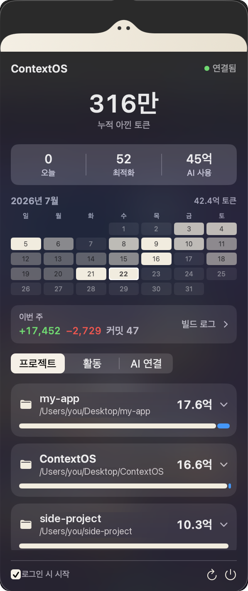

<p align="center">
  
</p>

<h1 align="center">ContextOS</h1>

<p align="center">AI 코딩 에이전트를 위한 로컬 컨텍스트 최적화 도구 · AI 없이 전부 내 컴퓨터에서</p>
<p align="center">Claude Code · Codex · Gemini CLI · Cursor · Windsurf</p>

<!--
  demo-mcp.svg 는 실제 동작을 재현한 애니메이션이고,
  dashboard.png 는 실제 앱의 화면 캡처(Retina 2x)입니다.
  캡처 후 개인 프로젝트의 이름·경로만 예시로 바꿨습니다 — 나머지 수치는 전부 실제 값입니다.
-->
<p align="center">
  
</p>
<p align="center">
  
</p>
<p align="center"><sub>메뉴바 아이콘을 누르면 나오는 대시보드. 맨 위에 사는 게 뭉치입니다.</sub></p>

---

**AI 코딩 에이전트를 위한 로컬 컨텍스트 최적화 도구.** AI를 쓰지 않고, 전부 내 컴퓨터에서만 동작합니다.

ContextOS는 AI 에이전트가 코드베이스 전체를 뒤지는 대신 **작업에 관련된 파일·함수만** 읽도록 도와줍니다. 그 결과 **더 적은 토큰으로 더 정확하게** 작업하게 됩니다. `contextos connect` 한 번이면 **Claude Code · Codex · Gemini CLI · Cursor · Windsurf** 중 설치된 모든 도구에 자동 연결됩니다.

> OpenAI / Claude / Gemini API 없음. LLM 호출 없음. 외부 서버 없음.
> AST·Tree-sitter 스타일 정적 분석·Git·파일시스템·규칙 기반 엔진만 사용합니다.

---

## 어떻게 동작하나요

1. `contextos connect` 를 한 번 실행하면, 설치된 각 AI 에이전트에 **"파일을 직접 탐색하기 전에 ContextOS부터 써라"** 는 지침이 심어지고 MCP 서버가 등록됩니다.
2. 이후 아무 프로젝트에서 에이전트로 작업하면, 에이전트가 **자동으로** ContextOS를 호출해 관련 파일만 받아 읽습니다.
3. 메뉴바 앱은 **얼마나 아꼈는지**를 실시간으로 보여줍니다.

당신은 아무것도 안 해도 됩니다. 최적화는 눈에 안 보이게 돌아갑니다.

```
평소처럼 AI 에이전트에 질문
   → ContextOS가 관련 파일·함수만 골라서 전달
   → 토큰 절약, 응답 품질 향상
```

---

## 주요 기능

- **프로젝트 인덱서** — 파일·심볼·import 관계를 한 번 분석해 로컬 SQLite에 저장. 이후엔 전체를 다시 읽지 않습니다.
- **스마트 파일 필터** — `node_modules`·`.git`·`build`·바이너리 등 노이즈 자동 제외. 프로젝트 루트의 `.gitignore` 패턴도 존중합니다.
- **자동 주입 훅** — Claude Code의 `UserPromptSubmit` 훅으로, **에이전트가 도구를 부르든 말든 매 프롬프트마다** 관련 파일·핵심 심볼을 자동 주입합니다. "먼저 ContextOS를 쓰라"는 지침에만 의존하지 않으니, 실제 절약이 매 턴 일관되게 발생합니다. (사소한 프롬프트는 건너뛰고, 실패해도 프롬프트를 막지 않음)
- **컨텍스트 옵티마이저** — 어휘 매칭 + **전역 IDF 가중치**(`file`·`view`처럼 코드베이스에 널린 흔한 단어는 강하게 감점, 희귀·핵심 심볼 우대) + **다중 매칭 가산점**(여러 용어가 걸린 파일 우대) + import 그래프 확장으로 랭킹하고, 토큰 예산 안에서 선택.
- **항상 최신 인덱스** — 매 쿼리마다 증분 재인덱싱(바뀐 파일만 재파싱)으로, 편집 직후에도 낡은 결과가 나오지 않습니다.
- **심볼 단위 슬라이싱** — 파일 전체 대신 **관련 함수 본문 + 나머지는 시그니처(목차)만** 전달. 큰 파일에서 토큰을 크게 절감.
- **세션 중복 제거** — 같은 세션에서 **이미 전달한 파일은 다시 보내지 않습니다** (내용이 바뀌었을 때만 재전송). 반복 질문 시 응답 크기가 ~90% 줄어듭니다.
- **예산 초과 파일 시그니처 목차** — 예산에 못 들어간 관련 파일도 이름만 버리지 않고 **심볼 목차(파일·라인·시그니처)** 로 압축해 함께 전달. 몇 토큰으로 주변 구조까지 파악.
- **능동적 쿼리 보정** — 169항목 한↔영 개발용어 사전(조사 자동 제거: "삭제가"→`delete`), 오타 교정(프로젝트 실제 심볼과 대조), 인덱스 기반 확장. "장바구니 버그 고쳐줘" → `cart, bug, fix` 로 알아서 이해.
- **Git 신호** — 지금 편집 중인(커밋 안 된) 파일을 감지해 관련 컨텍스트를 미리 준비.
- **파일 감시** — 파일이 바뀌면 인덱스를 자동 갱신.
- **로컬 토큰 추정** — 외부 API 없이 토큰 수를 근사.
- **메뉴바 모니터** — 아낀 토큰(오늘/누적), AI 토큰 사용량, 연결된 AI 도구, 프로젝트별 사용량, 이번 달 **토큰 캘린더**를 표시. "로그인 시 시작" 토글 지원.
- **코드 부채** — 프로젝트가 뭘 빚지고 있는지 **개수와 위치로**. 테스트에 한 번도 안 나오는 파일, 6개월 넘게 방치된 TODO(git blame 나이순), 거대·복잡 함수, 본문이 똑같은 중복 함수. 항목을 누르면 네가 쓰는 에디터에서 그 줄이 열립니다. 매일 스냅샷을 남겨 늘었는지 줄었는지도 보여줍니다.
  - "테스트 없는 파일"은 **프로젝트가 스스로 라이브러리라고 선언한 타겟만** 검사합니다(`Package.swift`의 `.target`/`.macro`). 실행 파일 타겟이나 어느 타겟에도 안 속한 스크립트는 `@testable import` 할 모듈 자체가 없어서, 테스트가 닿을 방법이 없으니 부채가 아닙니다. 폴더 이름 블록리스트가 아니라 프로젝트의 선언을 읽는 것이라, 매니페스트가 없으면 아무것도 걸러내지 않습니다.
  - **건강도 점수가 없습니다.** "87점"은 가중치가 필요한데(테스트 30%? TODO 10%?) 그 근거를 정직하게 댈 수가 없어서, 정밀해 보이는 지어낸 숫자가 됩니다. 게다가 87 → 84는 지시가 아닙니다 — 뭘 해야 할지 안 알려줘요. 반면 "PathResolution.swift에 테스트 없음"은 바로 알죠. 그리고 `#expect(true)` 5,000줄이면 점수는 오르고 코드는 그대로입니다.
  - **의존성 최신 여부도 없습니다.** 로컬로는 불가능합니다. lock 파일은 고정된 버전만 알고, *더 최신이 있는지*는 레지스트리에 물어야만 압니다. SPM 체크아웃도 소용없어요 — 로컬이 아는 최신 태그는 항상 고정된 그 버전입니다(resolve 할 때 fetch 했으니까). 답을 알아내는 유일한 길인 네트워크 호출은 로컬 전용 원칙을 깨고 네 의존성 목록을 남의 서버로 보냅니다. 이건 Dependabot·Renovate가 필요한 권한을 갖고 이미 잘합니다.
  - 각 항목 옆에 **판정 규칙이 그대로 표시됩니다**(예: "80줄 초과 또는 분기 15개 초과"). 정의를 숨긴 숫자는 반박할 수가 없으니까요. 전부 휴리스틱이지 판결이 아닙니다 — 간접적으로 테스트되는 파일도, 긴 게 당연한 룩업 테이블도 있습니다.
- **빌드 로그** — "오늘 뭐 했더라?"에 답하는 개발 일지. Git 커밋을 날짜별로 묶어 **추가/삭제된 줄 수, 커밋 수, 아직 커밋 안 한 작업**까지 보여주고, 각 커밋에 **어떤 AI가 참여했는지**(`Co-Authored-By` 트레일러 + 세션 시간대 대조)와 그날 쓴 토큰을 붙입니다. 커밋 메시지는 **그대로** 보여줍니다 — 이미 사람이 쓴 요약이고, 로컬에서 다시 요약해봐야 부정확해질 뿐이니까요.
  - 커밋을 "기능/버그"로 분류하지 **않습니다**. 그러려면 모든 저장소가 conventional commit(`feat:`/`fix:`)을 지켜야 하는데 대부분 그렇지 않고(이 저장소부터가 68커밋 중 0개), 아니면 LLM을 불러야 하는데 그건 ContextOS의 로컬 전용 원칙을 깹니다. 틀린 숫자를 자신 있게 보여주느니 정확한 것만 보여줍니다.
  - `package-lock.json`·`Package.resolved`·`node_modules`·생성 파일·minified 파일은 줄 수에서 제외합니다. lock 파일 한 번 갱신하면 수만 줄이라 나머지 숫자를 다 덮어버리니까요.
- **살아있는 마스코트(뭉치)** — AI에게 **명령을 보낸 순간부터 응답이 끝날 때까지** 잔잔히 움직입니다. 세션 로그·MCP 하트비트로 실시간 감지하고, 로그가 조용해도 **마지막 이벤트가 미완료 툴 호출이면**(긴 빌드·테스트 실행 중) 계속 활동 상태를 유지합니다. ContextOS가 실제로 최적화하는 순간엔 **파일을 꿀꺽꿀꺽 삼키며**(관련 파일·함수만 골라 먹는 모습) 오물거리고, 아무 일도 없으면 조용히 숨만 쉬어요.
  - MCP 하트비트는 **진짜 툴 호출(`tools/call`)에만** 뜁니다. 유휴 연결도 `ping`·`initialize`·`tools/list` 를 계속 주고받기 때문에, 모든 메시지에 하트비트를 쏘던 시절엔 **세션이 그냥 열려만 있어도** 뭉치가 아무것도 안 시켰는데 계속 먹었습니다.
  - 메뉴바와 대시보드의 뭉치는 **같은 절대 시계를 읽어서 같은 먹이를 같은 순간에** 씹습니다. 각자 자기 시작 시각부터 재던 시절엔 주기(0.55초 vs 0.85초)와 chomp 각속도(22.85 vs 22.18 rad/s)가 달라서 **약 9.4초마다 어긋났다 맞았다** 했습니다. 이제 뷰가 언제 생겼는지와 무관하고, 프레임률이 달라도 같은 동작을 샘플링할 뿐입니다.
  - 메뉴바 뭉치는 **자기 레이어에 그려집니다**. `button.image` 를 바꾸면 macOS 가 버튼 셀·메뉴바 배경·상태바 복제본 스냅샷을 전부 다시 그리는데, 실측으로 **초당 1회 교체당 약 0.6% CPU** 입니다 — 18px 글리프 하나 흔드는 데 코어의 10~25%가 나갑니다. 레이어의 `contents` 만 갈아끼우면 Core Animation 이 텍스처만 바꿔서 그 전부를 건너뜁니다: **10~13% → 1%**. 대신 `isTemplate` 의 자동 명암 반전은 NSImage 를 그릴 때만 붙는 기능이라 레이어에는 안 옵니다. 그래서 메뉴바의 실제 appearance(상태바 버튼은 `darkAqua` 가 아니라 `vibrantDark` 로 보고합니다 — `bestMatch` 로 풀어야 합니다)를 매 틱 읽어 색을 직접 칠하고, 바뀌면 루프를 다시 굽습니다.
  - **레이어에 직접 그리면 크기도 직접 책임져야 합니다.** `contentsGravity` 가 `.center` 면 레이어는 내용물을 `픽셀 ÷ contentsScale` 로 잡고 넘치는 만큼 **잘라냅니다** — 비트맵을 구운 배율과 레이어의 배율이 일치할 때만 크기가 맞는다는 뜻입니다. 근데 일치할 이유가 없습니다: 프레임은 `NSScreen.main`(지금 **포커스된** 화면)으로 굽고, 레이어의 배율은 **메뉴바가 떠 있는** 화면이 정합니다. 2x 내장 + 1x 외장에서 이 둘이 어긋나 뭉치가 정확히 절반 크기로, 그것도 **눈만 남은 가로 띠**로 잘려 나왔습니다. 지금은 `.resizeAspect` 로 레이어 크기에 맞춰 넣어서 배율이 뭐가 됐든 크기가 맞고, 배율은 선명도만 정합니다. 그 선명도용 배율도 `NSScreen.main` 이 아니라 **상태바 버튼이 실제로 올라간 창**에서 읽으니, 화면 사이로 옮기면 알아서 다시 구워집니다.
  - 애니메이션은 주기적이라 **한 번만 그려서 재생**합니다 (숨쉬기 π초, 씹기 0.55초 주기). 프레임률은 동작이 요구하는 만큼만 — 먹을 때 16fps, 숨쉴 때 4fps.
  - "부드럽게"의 지렛대는 프레임률이 아니라 **동작 곡선**입니다. chomp 를 완만하게(`pow` 4→2) 하면 프레임 사이 변화가 작아져 **같은 프레임률에서 더 부드럽게** 읽히고, 비용은 0입니다.
  - 팝오버를 닫으면 대시보드 뭉치의 타임라인도 멈춥니다. NSPopover 는 감춰도 뷰를 살려두기 때문에, 직접 멈추지 않으면 아무도 안 보는 패널에 메타볼을 계속 그립니다.
  - 팝오버 안에서도 뭉치는 **대시보드와 별개의 SwiftUI 트리**(각자의 `NSHostingView`)입니다. 한 트리를 공유하던 시절엔 마스코트의 매 프레임이 뷰 그래프를 무효화해서, SwiftUI 가 캘린더 31칸·프로젝트 카드까지 **패널 전체를 다시 레이아웃**했습니다. 프로파일 기준 작업 샘플 550개 중 250개가 `NSHostingView.layout` → `ViewGraph.updateOutputs` 였고, 정작 의심받던 Canvas blur 는 30개였습니다. 트리를 나누면 마스코트의 틱이 대시보드 그래프에 닿지 못합니다.
  - 대시보드 모델은 **값이 실제로 바뀐 것만** 발행합니다. `@Published` 는 같은 값을 다시 넣어도 발행하고, 폴러들은 2/4/32초마다 대개 동일한 숫자를 덮어쓰고 있었습니다.
- **가볍게 유지** — 메뉴바에 상주하는 프로그램이라 자원 사용을 실측해서 관리합니다. 앱 번들 **6.2MB**, 대시보드를 한 번도 안 연 상시 상태 **22MB**(`phys_footprint` 기준), 한 번 열어본 뒤 41MB, 콜드 인덱싱까지 포함한 피크 55MB. 프로젝트당 인덱스 170~185KB, 전역 데이터 168KB. 8GB 맥에서 개발하는 사람도 부담 없이 켜둘 수 있어야 하니까요.
  - 세션 로그(여기선 167MB, 단일 파일 83MB)는 **줄 단위로 흘려보내며** 읽습니다. 통째로 올리면 `Data` 로 한 번, `String` 으로 또 한 번 — 콜드 파싱 피크가 **295MB** 까지 갔었습니다. 지금은 파일이 몇 GB든 청크 하나(256KB)로 고정입니다.
  - 결정적이었던 건 **오토릴리즈 풀의 위치**입니다. `FileHandle.read` 는 autorelease 된 `Data` 를 돌려주기 때문에, 읽기가 풀 밖에 있으면 256KB 청크가 파일이 끝날 때까지 전부 살아남습니다 — 메모리가 파일 크기를 1:1로 따라가던 이유가 이것이었습니다. 읽기까지 풀로 감싸서 **258MB → 14MB**.
- **12개 언어 심볼 인덱싱** — Swift · Python · JS/TS · Go · Rust · Java · Kotlin · C · C++ · Ruby · Objective-C.

---

## 설치 & 사용

### 1. 빌드

```sh
swift build -c release          # CLI / MCP / 앱 빌드
swift test                      # 테스트
```

### 2. AI 에이전트에 연결 (핵심)

```sh
.build/release/contextos connect
```

이 한 줄이 **설치된 모든 AI 에이전트**를 자동으로 찾아 연결합니다:

| 에이전트 | MCP 등록 | 자동 사용 지침 |
|---|---|---|
| Claude Code | `claude mcp add` (전역) + 자동 주입 훅 | `~/.claude/CLAUDE.md` |
| Codex CLI | `~/.codex/config.toml` | `~/.codex/AGENTS.md` |
| Gemini CLI | `~/.gemini/settings.json` | `~/.gemini/GEMINI.md` |
| Cursor | `~/.cursor/mcp.json` | (Cursor 설정에서 규칙 추가) |
| Windsurf | `~/.codeium/windsurf/mcp_config.json` | — |

설치 안 된 도구는 건드리지 않고, 다시 실행해도 중복 없이 갱신만 됩니다. **도구를 재시작**하면 이후 모든 프로젝트에서 자동 적용됩니다.

### 3. 메뉴바 앱 (선택)

```sh
./scripts/build_app.sh              # 빌드 → 기존 설치 위치에 덮어쓰기 → 재실행
./scripts/build_app.sh --to /Applications/ContextOS.app   # 설치 위치 지정
./scripts/build_app.sh --no-install # dist/ 에만 만들고 설치는 안 함 (CI용)
```

메뉴바 아이콘을 클릭하면 절약량·AI 사용량·연결된 도구·이번 달 토큰 캘린더를, "빌드 로그"를 누르면 개발 일지(빌드 로그)와 코드 부채를 볼 수 있습니다.

처음이면 `/Applications/ContextOS.app` 에 설치되고, 이미 설치돼 있으면 **그 자리에** 덮어씁니다. 설치 위치는 이 순서로 찾습니다: ① 지금 실행 중인 앱 → ② `~/.claude.json` 에 등록된 MCP 서버가 들어있는 번들 → ③ `/Applications` · `~/Applications` · `~/Desktop`.

> **왜 그냥 dist/ 에 두고 드래그하지 않나:** 번들 ID가 `com.contextos.app` 로 고정이라, **같은 앱이 두 경로에 있으면 macOS가 별개 앱으로 취급해 메뉴바에 아이콘이 2개** 뜹니다. 그래서 스크립트는 설치 후 `dist/ContextOS.app` 을 지우고, 다른 복사본이 남아 있으면 경고합니다.
>
> 직접 정리할 때 `pkill -f "ContextOS.app"` 은 쓰지 마세요. 이 패턴은 번들 안의 `contextos-mcp` (에디터가 지금 물려 있는 MCP 서버)까지 잡아 죽입니다. 앱만 끄려면 `pkill -f "ContextOS.app/Contents/MacOS/ContextOSApp"`.

---

## 구성

모든 로직은 `ContextOSCore` 에 있고, 나머지는 얇은 어댑터입니다.

```
Claude Code · Codex · Gemini
Cursor · Windsurf ──MCP(stdio)──▶ contextos-mcp ──▶ ContextOSCore ──▶ SQLite 인덱스
메뉴바 앱   ──────────────────────────────────────────┘
CLI (개발용) ─────────────────────────────────────────┘
```

| 타깃 | 역할 |
|---|---|
| `ContextOSCore` | 인덱싱·최적화·슬라이싱·보정 등 순수 로직 |
| `contextos` | CLI (`connect` · `context` · `watch`) |
| `contextos-mcp` | AI 에이전트용 MCP 서버 (stdio JSON-RPC) |
| `ContextOSApp` | SwiftUI 메뉴바 모니터 |

### CLI 명령

| 명령 | 설명 |
|---|---|
| `contextos connect` | 설치된 모든 AI 에이전트 자동 연동 (지침 설치 + MCP 등록) |
| `contextos context "<작업>"` | 관련 파일을 직접 찾기 (붙여넣기용) |
| `contextos watch [경로]` | 파일 변경 시 자동 재인덱싱 |
| `contextos hook` | Claude Code 훅 진입점 — stdin JSON을 읽어 컨텍스트를 주입하고 뭉치를 실시간으로 움직입니다. `connect` 가 알아서 등록하므로 직접 칠 일은 없습니다 |

### MCP 도구 (AI 에이전트가 자동 호출)

| 도구 | 설명 |
|---|---|
| `get_relevant_context` | 작업에 관련된 최소 파일 목록 반환 |
| `read_optimized` | 관련 파일 내용을 (슬라이싱·세션 중복 제거해) 반환. `fresh=true`로 전체 재전송 |
| `index_project` | 프로젝트 강제 재인덱싱 |
| `project_stats` | 인덱스 통계 |
| `get_project_rules` | 프로젝트 규칙 파일(`.contextos/rules.md`·`CLAUDE.md`·`AGENTS.md`·`.cursorrules`) 읽기 |
| `restore_session` | 세션 시작용 프로젝트 상태 요약 (브랜치·미커밋 변경·최근 커밋·최근 활동) |

### 에이전트별 로컬 데이터

토큰 사용량은 **각 도구가 스스로 기록한 값**만 씁니다. 추정하지 않고, 없으면 없다고 합니다. 전부 사용자 디스크의 사용자 파일이며 아무것도 밖으로 나가지 않습니다.

| 에이전트 | 위치 | 토큰 집계 |
|---|---|---|
| Claude Code | `~/.claude/projects/<cwd>/*.jsonl` | ✅ 메시지마다 정확한 `usage` + ISO8601 타임스탬프 + `cwd` |
| Codex | `~/.codex/sessions/**/rollout-*.jsonl` | ✅ `token_count` 이벤트의 **누적** `total_token_usage` (연속 값의 차분으로 일별 집계 — 도구가 주는 `last_token_usage`를 더하면 ~1% 높게 샘) |
| Gemini CLI | `~/.gemini` | ❌ 채팅 로그만 있고 토큰 회계 없음 (텔레메트리는 opt-in OTLP → 콜렉터로 감, 디스크 아님) |
| Cursor | `state.vscdb` | ❌ 비공개 SQLite(버전마다 스키마 변경) + 토큰은 서버 사이드 구독 집계 |

Gemini CLI와 Cursor도 **탐지**하고 ContextOS **연동**은 해줍니다 — 다만 없는 숫자를 지어내지 않을 뿐입니다.

**빌드 로그는 에이전트와 무관합니다.** 어떤 에이전트를 쓰든 결과물은 같은 곳(Git 저장소)에 남으니, 일지는 Git을 읽습니다. 직접 손으로 친 코드까지 잡히는 건 덤이고요. 에이전트 기록이 더해주는 건 **귀속과 비용**(어떤 커밋에 AI가 관여했는지, 그날 토큰을 얼마나 썼는지)인데, 이건 `git log` 혼자서는 못 하는 부분입니다.

---

## 개발 환경

- macOS 14+ / Swift 6
- 의존성: `swift-argument-parser` (그 외 외부 의존성 없음, SQLite는 시스템 제공)

```sh
swift build        # 디버그 빌드
swift test         # 테스트
swift run contextos context "로그인 수정"   # CLI 실행
```

---

## 설계 철학

- 최대한 적은 컨텍스트로 최대한 높은 정확도.
- 프로젝트 전체를 반복해서 읽지 않는다.
- 모든 처리는 로컬에서. 개인정보는 외부로 나가지 않는다.
- 사용자는 가능한 한 아무것도 설정하지 않는다.
